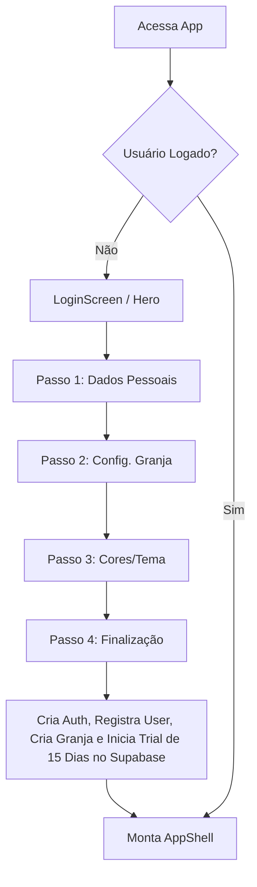
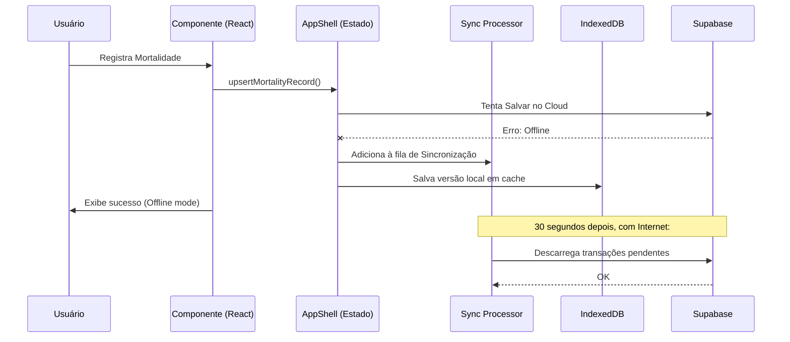

# Documentação Técnica e Arquitetural - Granja de Bolso 3.1

## 1. Visão Geral do Sistema

*   **Objetivo da aplicação:** O Granja de Bolso 3.1 é uma plataforma de gestão inteligente voltada para granjas (especialmente focado em aves caipiras). Ele auxilia na administração financeira, manejo de animais, controle de estoque, formulação de ração, previsão do clima e planejamento de investimentos.
*   **Principais funcionalidades:**
    *   Gestão de Animais e Lotes (Mortalidade, Produtividade).
    *   Controle Financeiro (Vendas, Compras, Fluxo de Caixa).
    *   Gestão de Clientes e Fornecedores.
    *   Módulo de Clima (Previsão de tempo para manejo térmico).
    *   Calculadora de Investimentos e Formulação de Ração.
    *   Sistema de Backup e Sincronização Offline-First.
    *   Assinaturas e Billing (Stripe).
*   **Tecnologias utilizadas:**
    *   **Frontend:** React 19, Vite 6, TypeScript.
    *   **Estilização e UI:** Tailwind CSS v4, Lucide React (Ícones), Motion (Framer Motion - Animações), Vanilla CSS.
    *   **Backend e Banco de Dados:** Supabase (PostgreSQL, Auth, RLS, Edge Functions).
    *   **Gráficos e Relatórios:** Chart.js, react-chartjs-2, jsPDF.
    *   **Armazenamento Offline:** IndexedDB (`idb-keyval`).
    *   **Integrações:** Stripe, Open-Meteo, OpenWeather.

---

## 2. Arquitetura do Projeto

*   **Estrutura de pastas e arquivos (Principais):**
    ```text
    /src
      /components     # Componentes reutilizáveis de UI e modais
      /data           # Dados estáticos e de suporte
      /hooks          # Custom Hooks (ex: usePagination)
      /lib            # Utilitários, serviços de integração (Supabase, Stripe, Sync, Offline)
      /pages          # Páginas/Módulos principais do sistema
      /ui             # Componentes base do Design System (Botões, Inputs)
      App.tsx         # Ponto de entrada, Router de Onboarding, Auth Listener
      AppShell.tsx    # Layout Principal, Roteamento interno e Gestor de Estado Global (Cadastros)
      index.css       # Configurações do Tailwind, Variáveis CSS, Animações Nativas
    /api & /server    # Proxies backend no ambiente Vite para segurança e bypassing de CORS
    /supabase         # Configurações, Migrações e Scripts SQL
    ```

*   **Padrões Arquiteturais adotados:**
    *   **Single Page Application (SPA):** Roteamento totalmente no lado do cliente.
    *   **Offline-First & Local-First:** Utilização de `IndexedDB` para cache e fila de sincronização em background.
    *   **Feature-Based Organization:** Módulos isolados dentro da pasta `/pages`.
    *   **State Machine (Onboarding):** Controle explícito de passos no `App.tsx` para garantir a progressão da captura de dados.

*   **Fluxo Geral de Funcionamento:**
    1.  O `App.tsx` carrega, verifica a sessão via Supabase e decide entre `LoginScreen`, `Onboarding` ou prosseguir para o sistema.
    2.  Ao entrar no sistema, o componente `AppShell.tsx` é montado. Ele gerencia o ciclo de vida dos dados (CRUDs), efetua requisições ao Supabase e armazena fallback no IndexedDB.
    3.  A navegação ocorre trocando o `activeRoute`, que carrega dinamicamente via `React.lazy` a respectiva "Page".

---

## 3. Documentação dos Componentes

Os componentes são focados na reutilização e encapsulamento da lógica visual.

*   **`AppShell.tsx`:**
    *   **Responsabilidade:** Container mestre da área logada, provedor de layout (Sidebar) e gestor de estado mestre de dados de negócio.
    *   **Estados Principais:** `activeRoute`, `isSidebarCollapsed`, e listas completas de cadastros (animais, clientes, manejo, etc).
    *   **Eventos:** Despacha funções CRUD (ex: `upsertAnimal`, `removeAnimal`) via "prop drilling" para as páginas.
*   **`Sidebar.tsx`:**
    *   **Responsabilidade:** Navegação do menu lateral responsivo.
    *   **Fluxo de Comunicação:** Recebe o `activeRoute` e `onNavigate` do pai (`AppShell`), permitindo a troca da página renderizada.
*   **Componentes de Onboarding (`StepPersonalData`, `StepFarmConfig`, etc):**
    *   **Responsabilidade:** Coleta gradual dos dados do usuário.
    *   **Comunicação:** Atualiza o objeto de estado consolidado `OnboardingState` gerido pelo `App.tsx`.
*   **Componentes de UI Base (pasta `/ui`):**
    *   Contém abstrações padrão como Botões, Cards, Inputs, Toast, construídos com foco no Design System e Tailwind.

---

## 4. Documentação dos Módulos (Pages)

Cada módulo na pasta `/pages` encapsula o comportamento visual e lógico de uma feature de negócio.

*   **`AnimaisPage` & `ManejoPage`:** Gestão de lotes, registro de mortalidade, consumo de ração e índices produtivos. Consomem e atualizam a prop genérica e enviam ao Supabase através das props repassadas pelo `AppShell`.
*   **`FinanceiroPage`, `VendasPage`, `ComprasPage`:** Módulos vitais do ERP caipira. Lidam com cálculo de custos, margem de lucro e relação com `ClientePage` e `FornecedorPage`.
*   **`ClimaPage`:** Integração via proxy com APIs (Open-Meteo) informando dados críticos para manejo (sensação térmica, umidade) para prever estresse calórico nas aves.
*   **`FormulacaoPage`:** Motor técnico zootécnico. Utiliza algoritmos ou cálculos direcionados para gerar dietas balanceadas para as aves, gerindo matriz nutricional.
*   **`InvestimentosPage`:** Simulador dinâmico de projetos. Cria cenários financeiros com custo de infraestrutura e viabilidade, focado na precisão de custo.
*   **`AdminPage`:** Área restrita (baseada em Role). Gerencia "Promoter Access" e "Users Overview" via APIs Proxy exclusivas.

---

## 5. Fluxo de Dados

O sistema segue um fluxo híbrido Cloud-Local altamente resiliente:

1.  **Componente da Interface:** Dispara uma intenção (ex: "Adicionar Animal").
2.  **Gestão de Estado (AppShell):** A função de handler (ex: `upsertAnimal`) é acionada, configurando UI flags (`isCadastrosSyncing`).
3.  **Persistência Híbrida (`src/lib/supabase.ts` e `offlineStore.ts`):**
    *   Tenta comunicação com Supabase (PostgreSQL).
    *   Em caso de sucesso: Retorna a entidade salva, o `AppShell` atualiza seu array React (State), e a interface reflete. Em seguida, a versão mais recente salva um cache no IndexedDB (`saveToCache`).
    *   Em caso de erro de rede (Offline): O `syncProcessor.ts` captura a ação, coloca numa fila, e a UI funciona com dados provenientes do Cache Local de Leitura.
4.  **Gestor em Background:** Sempre que a rede (`navigator.onLine`) volta ao normal, o `syncProcessor.ts` despeja as mutações represadas no banco de dados.

---

## 6. Interface do Usuário (UI)

*   **Estrutura de Telas:** Abordagem Mobile-First, focada na visualização limpa em smartphones no campo. O layout tem Sidebar colapsável à esquerda e área de conteúdo expansiva.
*   **Design Paradigm:** Moderno, utilizando efeitos de Glassmorphism, Rounded Cards e Micro-interações.
*   **Responsividade:** O menu lateral recua ou vira "Drawer" em telas pequenas. Padding e espaçamentos dinâmicos controlados por variáveis (`--page-padding`, `safe-area-inset`).
*   **Hierarquia:** Títulos bem definidos (`app-section-title`), tags descritivas (`app-section-badge`) e separação em Cards de KPIs.

---

## 7. Design System

*   **Temas e Cores Dinâmicas:** Variáveis CSS são injetadas em Runtime (`App.tsx` via `lib/theme.ts`) e o projeto permite personalização.
    *   `--brand-primary`, `--brand-hover`, `--brand-active`, `--brand-bg`, `--brand-main`.
    *   Suporte ativo a Modo Escuro (`isDarkMode`) que inverte paletas automaticamente (fundo preto `#0b1220`, texto claro).
*   **Tipografia:** Suporte a múltiplas fontes (Inter, Roboto, Outfit, Poppins, Nunito). Trocável via preferências (`app-font`).
*   **Containers:** Bordas arredondadas configuráveis (ex: `var(--card-radius)`), sombras densas (`shadow-3xl`), animações de fading nativas (CSS Keyframes como `fadeInUp`, `scaleIn`).

---

## 8. Estilização

*   **Framework:** **Tailwind CSS v4** atuando como utilitário principal.
*   **Vanilla CSS Complementar (`index.css`):**
    *   Implementação de propriedades PWA nativas (Scroll behavior, tap highlight transparente, touch action).
    *   Estilos globais modulares: `.mobile-card`, `.kpi-card`, `.app-section-card`.
    *   Sistema de classes rígido para transições (ex: `.animate-fade-in-up`, `.skeleton` para carregamento de placeholders).
*   **Regras de Dark Mode:** Utiliza variação de seletores aninhados: `.dark-theme .bg-brand-main { background-color: #0b1220 !important; }` garantindo alto contraste e elegância em ambientes de pouca luz.

---

## 9. APIs e Integrações

*   **Proxies Nativos (Vite/Node):** Configuradas no `vite.config.ts` para mitigar CORS e isolar segredos.
    *   `/api/weather/open-meteo` e `/api/weather/openweather`
    *   `/api/billing/*` (Integração pesada com **Stripe** via Checkout/Portal Session, manipulada no Node e capturada por Webhooks).
    *   `/api/admin/*`
*   **Supabase (BaaS):** Conexão via SDK (`@supabase/supabase-js`).
    *   **Autenticação:** Baseado em e-mail e MFA (TOTP) validado no endpoint.
    *   **Base de Dados:** Chamadas diretas (PostgREST API).

---

## 10. Banco de Dados

*   **SGBD:** PostgreSQL (Supabase).
*   **Entidades/Modelos identificados:**
    *   `users`, `granjas` (Configuração Core).
    *   `animais`, `manejo_diario`, `mortalidade`.
    *   `vendas`, `compras`, `clientes`, `fornecedores`.
    *   `ingredientes`, `formulacoes` (Ração).
    *   `backups`.
*   **Relacionamentos:** Estruturados via Foreign Keys. A entidade `Granja` funciona como Tenant (Multitenancy).
*   **Triggers / RLS:** Regras rígidas (Row Level Security) garantindo que um usuário só pode acessar (Select/Insert/Update/Delete) os registros atrelados à sua conta Auth (`auth.uid()`).

---

## 11. Segurança

*   **Prevenção IDOR (Insecure Direct Object Reference):** Endpoints e Row Level Security foram endurecidos para verificar a ligação relacional, não confiando apenas no ID passado no payload (Ação implementada em revisão passada).
*   **Sanitização:** Proteção em nível de banco de dados (SQL Triggers) contra inputs maliciosos e XSS no cadastro.
*   **Autenticação Reforçada:** Obrigatoriedade de Validação de Senhas Complexas, MFA (Multi-factor Authentication via TOTP) configurável.
*   **Rate-limiting:** Proteção contra abusos de requisição no cadastro/catálogo público.

---

## 12. Fluxos Funcionais

**1. Fluxograma - Onboarding de Novo Usuário:**


**2. Fluxograma - Operação Diária Offline:**


---

## 13. Pontos de Melhoria e Refatorações Recomendadas

1.  **Refatoração do Estado Global (AppShell.tsx):**
    *   **Problema:** O arquivo `AppShell.tsx` (74kb+, ~2000 linhas) acumula todo o gerenciamento de estados (`useState`), requisições de montagem e delegação CRUD.
    *   **Solução:** Migrar os dados dos módulos (Animais, Financeiro, Cadastros) para uma biblioteca de gerenciamento de estado como **Zustand** ou no mínimo **React Context API**, segmentando lógicas em "Slices".
2.  **Adoção de Sistema de Roteamento Padrão:**
    *   **Problema:** A navegação ocorre por mutação de string `activeRoute`, dificultando URLs diretas (Deep Linking) e SEO interno.
    *   **Solução:** Implementar `react-router-dom` para viabilizar URLs como `/app/animais` e uso prático do botão de "Voltar" nativo do sistema/navegador.
3.  **Modularização do Supabase Client:**
    *   **Problema:** O arquivo `src/lib/supabase.ts` está massivo (97kb). Contém lógica de Auth, CRUDs variados e utilitários juntos.
    *   **Solução:** Dividir em repositórios segregados (`animais.repository.ts`, `financeiro.repository.ts`, `auth.service.ts`).
4.  **Otimização de Renderização (Performance):**
    *   Componentes na `AppShell` estão sendo recriados com prop drilling agressivo. Aplicar mais `useMemo` nas listas de dados processadas e `useCallback` em manipuladores profundos.

---

## 14. Conclusão

O **Granja de Bolso 3.1** possui uma arquitetura tecnicamente madura, evidenciando uma visão avançada de desenvolvimento **Mobile-First** e **Offline-First**. O projeto adere às melhores práticas de PWA moderno (React 19 + Vite), entregando uma experiência quase nativa (animações refinadas, UX pensada para toque, uso agressivo de tipografia e glassmorphism).

**Pontos Fortes:**
*   Resiliência robusta através do uso consciente de IndexedDB para operação em áreas rurais de baixa conectividade.
*   Integrações nativas proxyadas e gestão de assinatura via Stripe, fechando o ciclo do modelo de negócio (SaaS).
*   Segurança reforçada por trás das regras RLS do Supabase.

**Limitações Atuais:**
*   A concentração do controle de dados em componentes estruturais únicos (como `AppShell` e `supabase.ts`) apresenta um risco moderado de dificuldade de escalabilidade técnica futura para novos membros de equipe.

**Recomendações:**
Focar a próxima iteração técnica em **Refatoração Arquitetural de Estado** e **Roteamento de URLs**, mantendo a excepcional interface atual intocada. Tais movimentos reduzirão a dívida técnica sem impactar a entrega de valor ao usuário final, preparando o terreno para as próximas expansões.
